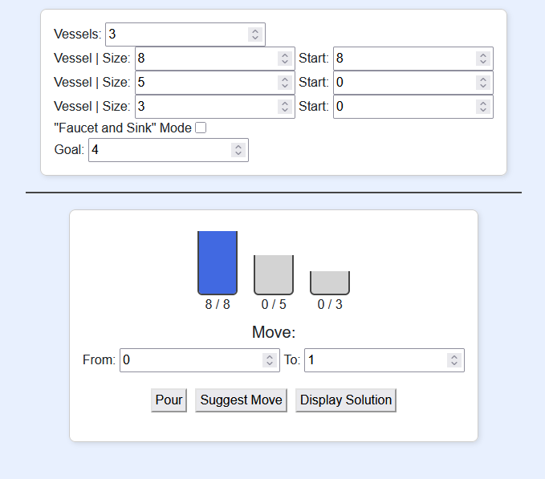
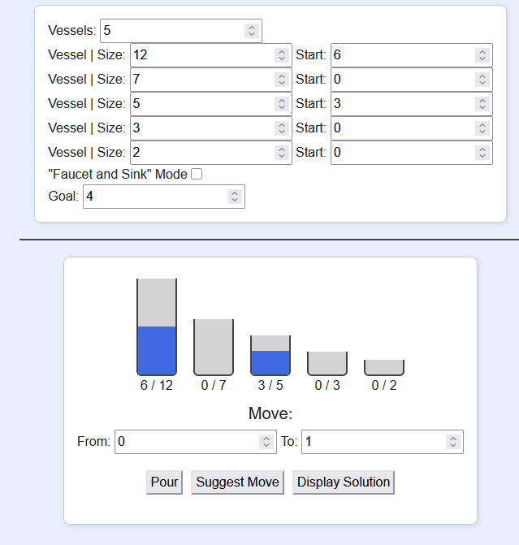
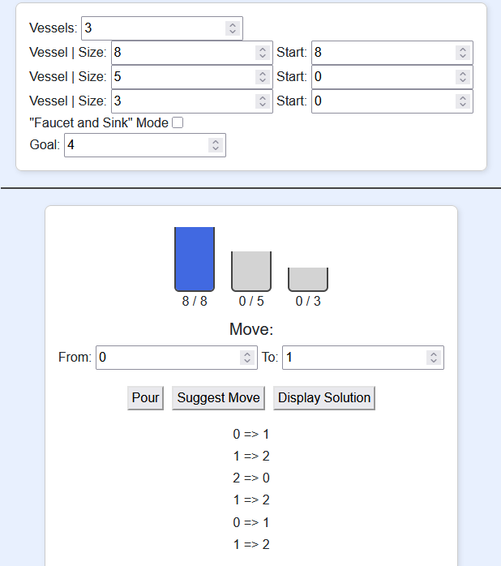

# Pouring Puzzle Solver

A web-based interactive solver for the classic *water jug* problem. Users can configure custom vessel sizes and fill levels, then explore the shortest path to reach a target amount by pouring between vessels.

🌐 **Live Demo:** [https://www.pouringpuzzle.net](https://www.pouringpuzzle.net)

---

## 🧠 About the Puzzle

The "pouring puzzle" (also called the **water jug problem**) is a logic challenge involving a set of containers with fixed sizes. The goal is to measure out a specific volume using only a series of pours between the containers.

This puzzle has appeared in several well-known media:

- 🧪 **Resident Evil 2 Remake** – The *Herbicide Mixing Puzzle* in the greenhouse uses this exact logic with 8, 5, and 3 unit vessels.
- 💣 **Die Hard with a Vengeance** – In the *fountain scene*, Bruce Willis and Samuel L. Jackson solve the 5- and 3-gallon jug puzzle to defuse a bomb.

---

## 🧰 Features

- 🔁 **Shortest-path solver** using recursive graph traversal and reverse node linking
- 🧮 **Custom puzzle setup**: choose any number of vessels, define their capacities and starting amounts
- 🖥️ **Blazor-based frontend** with responsive UI and real-time updates via two-way data binding
- 🧩 **Visual step-by-step guidance** through the puzzle graph
- 🌐 **Hosted on Azure App Service** with custom domain and HTTPS
- 🔄 **GitHub Actions CI/CD** for automatic deployment

---

## Screenshots 🖼️







## Contributing 🤝

While this is primarily a personal project, feedback and suggestions are welcome!

If you'd like to experiment with changes:
1. Fork the repository

2. Create a feature branch:
   ```bash
   git checkout -b my-feature-branch

3. Commit your changes:
   ```bash
   git commit -m "Add cool feature"
   
4. Push to your branch and open a pull request

## License 📜

This project is licensed under the MIT License - see the LICENSE file for details.

## Contact 📬

For questions or feedback, feel free to open an issue or reach out through GitHub.

⭐ If you find this project useful, consider giving it a star! ⭐
